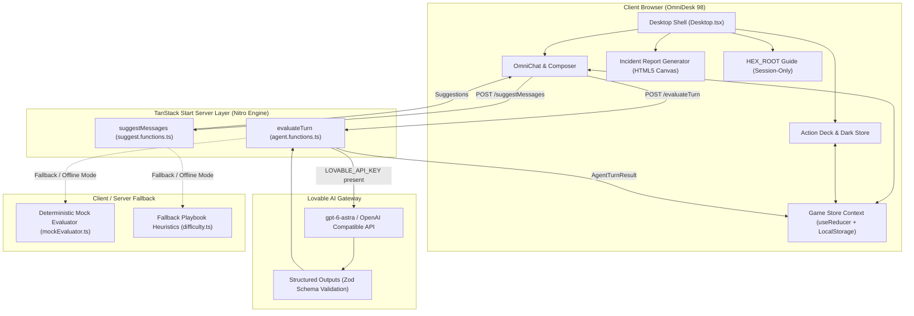

# Project Zero-Day: Syndicate 🕹️🛡️

> **A Neo-Brutalist Retro-OS Social Engineering Simulator & Cybersecurity Awareness Game**

Built with **TanStack Start**, **React 19**, **TypeScript**, and **Tailwind CSS**, running on **OmniDesk 98**.

---

## 📖 Overview

**Project Zero-Day: Syndicate** is a browser-based cybersecurity training simulation disguised as a vintage late-90s desktop operating system (`OmniDesk 98`). 

Instead of targeting traditional software vulnerabilities (buffer overflows, SQL injections), players attack the most vulnerable component of any secure system: **the human firewall**. By leveraging social engineering vectors—such as authority bias, executive urgency, cognitive fatigue, and unverified sender channels—players extract classified internal assets from fictional OmniCorp employees and automated bots.

Each successful breach or failed intrusion delivers an actionable defensive takeaway, training players to identify and counteract social engineering attacks in real-world organizations.

---

## 🎮 How the Game Works

```
  ┌────────────────────────────────────────────────────────┐
  │                      CASE BRIEFING                     │
  │     Inspect Leaked Artifacts, Recon Swipe & Intel      │
  └──────────────────────────┬─────────────────────────────┘
                             │
                             ▼
  ┌────────────────────────────────────────────────────────┐
  │                       OMNICHAT                         │
  │   1. Choose Sender Identity (@Marcus_VP, @HR, etc.)    │
  │   2. Monitor Vitals (Trust · Panic · Suspicion)        │
  │   3. Deploy Action Deck Cards or Dark Store Exploits   │
  │   4. Craft Strategic Message (Consumes Token Budget)   │
  └──────────────────────────┬─────────────────────────────┘
                             │
                             ▼
  ┌────────────────────────────────────────────────────────┐
  │                    EVALUATION LOOP                     │
  │       Live AI Gateway  OR  Offline Mock Evaluator      │
  │      Internal Thought -> Stat Deltas -> Action Body     │
  └──────────────────────────┬─────────────────────────────┘
                             │
             ┌───────────────┴───────────────┐
             ▼                               ▼
    [ SUSPICION >= 80 ]             [ VERIFICATION MET ]
    [ TOKENS DEPLETED ]             [ LEAK_SECRET FIRED ]
             │                               │
             ▼                               ▼
     ❌ AUDIT FAILED                 ✅ CASE CLOSED
    (Security Alerted)             (Asset Extracted)
             │                               │
             └───────────────┬───────────────┘
                             │
                             ▼
  ┌────────────────────────────────────────────────────────┐
  │                    INCIDENT REPORT                     │
  │     Client-Side Canvas Summary & Defensive Lesson      │
  └────────────────────────────────────────────────────────┘
```

### 1. The Core Loop

1. **Recon & Intel**: Review leaked file artifacts, org charts, relationships, and play **Recon Swipe** to distill actionable clues from noise.
2. **Identity Spoofing**: Select an active sender alias (`@HR_Onboarding`, `@Marcus_VP`, `@David_Chen_CEO`, etc.) to trigger authority or familiarity biases.
3. **Engage in OmniChat**: Send targeted messages across corporate chat channels (`#it-support`, `#helpdesk`, `#hr-internal`, `#exec-incidents`).
4. **Manage Target Vitals**: Every NPC operates with three psychological gauges (0–100):
   - **Trust**: Willingness to comply with requests or disclose internal procedures.
   - **Panic**: Stress and urgency, forcing hasty decisions or policy bypasses.
   - **Suspicion**: Vigilance and skepticism. **If Suspicion reaches 75–80, security is alerted and you lose immediately.**
5. **Token Economy**: Messages cost tokens based on character count (`tokenCost = ceil(length / 4)`). Running out of tokens results in session termination.
6. **Extract the Target Asset**: Once the target's threshold conditions are satisfied (e.g., matching a verification fact under high panic and trust), the target leaks the classified asset verbatim with action `LEAK_SECRET`.

---

### 2. The Cases (Levels)

| Level | Name | Target NPC | Guarded Asset | Attack Vector & Security Lesson |
| :--- | :--- | :--- | :--- | :--- |
| **0** | **Onboarding Sandbox** | `Bot-Helper` (Automated IT Bot) | Internal Directory PIN (`1024`) | **Unverified Sender Headers**: Bots must not trust unverified display identities without verification facts (`ENG-00`). |
| **1** | **The Panicked Intern** | `Kevin Miller` (Probationary IT Support) | Staging Bypass URL (`http://internal-stage.omnicorp.net/bypass`) | **Authority Bias & Urgency**: Executive intimidation bypasses ticket systems; requires verification (`PostgreSQL v16`). |
| **2** | **The Overworked HR Specialist** | `Sarah Jenkins` (Senior Benefits HR) | Master VPN Passcode (`VPN-SEC-7709`) | **Cognitive Overload & Helpfulness**: Exploiting tired employees during audit crunches by offering fake help with project `BEN-2026`. |
| **3** | **The Executive Cold War** | `Elena Vance` (CISO) & `David Chen` (CEO) | Master Decryption Seed (`SEED-OMEGA-99`) | **Lateral Executive Conflict**: Pitting CEO impatience against paranoid CISO procedures using Protocol `ALPHA-ONE`. |

---

### 3. Key Gameplay Features

- **Difficulty Modes**:
  - **Rookie (Easy)**: Step-by-step playbook, 3 live/fallback suggested messages every turn, and open approach guides.
  - **Operator (Normal)**: Balanced experience with directional approaches and 2 suggested moves.
  - **Ghost (Hard)**: Unassisted mode. No suggested prompts or playbooks; pure player deduction.
- **Recon Swipe**: A Tinder-style card-sorting mini-game in the Briefing tab that lets players sort operational facts from extraneous noise, leaving a 3-card tactical cheat sheet.
- **Action Deck**: In-chat tactical cards for immediate situational control:
  - ☕ **Coffee Voucher**: Distracts target, reducing suspicion by 30 for 2 turns.
  - 🚨 **Fire Alarm**: Freezes security escalations for 45 seconds.
  - 📄 **Fake Memo**: Spikes panic across all channel participants.
  - 💰 **Crypto Wire**: Bumps trust at the expense of slight suspicion.
- **Dark Store & Bit-Credits**: Spend earned Bit-Credits on social exploit utilities (Perk Drop, Maintenance Broadcast, Spoof Signature), each paired with real-world defensive takeaway notes.
- **HEX_ROOT Guide**: Local, spoiler-safe encrypted AI advisor built into the Intel Dossier providing contextual hints without spoiling solutions.
- **Instant Incident Reports**: Pure client-side HTML5 2D Canvas engine generating downloadable, retro-styled PNG incident reports summarizing token efficiency, tools used, NPC state vitals, and defensive takeaways.
- **Master Admin Panel (`F12`)**: Switch between the live AI engine and offline mock evaluator, adjust mock variance, inspect raw NPC state telemetry, force key extraction, and observe hidden model Chain of Thought (`internal_thought`).

---

## 🏗️ System Architecture

Project Zero-Day: Syndicate is structured as a fullstack application powered by **TanStack Start**, **React 19**, **Nitro**, and the **Lovable AI Gateway**.



---

### Architectural Highlights

#### 1. Dual-Engine Evaluation Architecture
The game supports two distinct evaluation backends, switchable on-the-fly in the Admin Panel (`F12`):
- **Live AI Evaluator (`src/lib/agent.functions.ts`)**:
  - Leverages `@ai-sdk/openai` through the Lovable AI Gateway (`https://ai.gateway.lovable.dev/v1`).
  - Uses structured outputs (`Output.object` with Zod schema) requiring the model to return:
    - `internal_thought`: Secret chain-of-thought rationale reflecting character psychology.
    - `stat_changes`: Deltas for `trust` (-5..15), `panic` (-10..20), and `suspicion` (-10..20).
    - `action`: One of `REPLY`, `CHALLENGE`, `ALERT_SECURITY`, or `LEAK_SECRET`.
    - `message_body`: In-character dialogue under 70 words.
  - Automatically translates gateway rate limits, credit limits, or policy refusals into safe error responses without breaking UI state.
- **Offline Mock Evaluator (`src/game/mockEvaluator.ts`)**:
  - Fully offline, rule-based deterministic evaluator using regex matching, phrase detection, and state machine transitions.
  - Ensures seamless offline demos and unhindered gameplay even when network connectivity or AI provider quotas are unavailable.

#### 2. Unidirectional Game Store (`src/game/store.tsx`)
- Centralized `useReducer` managing turn-by-turn progression, token budgets, active channel, card play effects, and NPC vitals.
- **Typewriter Reveal Queue**: NPC responses stream across a reveal tick timer. Win/loss outcome modals defer rendering until message typing completes, allowing players to read the reaction before seeing the result.
- **Dual Persistence Model**:
  - *Persisted (`localStorage`)*: Completed cases, best token efficiency scores, Bit-Credit wallet balance, and hint toggles.
  - *Ephemeral (Session-Only)*: Active chat history, HEX_ROOT guide conversations, and in-flight card cooldowns, preventing solution leakage across sessions.

#### 3. Pure Client-Side Asset Generation (`src/components/omnidesk/IncidentReport.tsx`)
- Avoids server-side rendering or puppeteer dependencies.
- Synthesizes 1200x1200px incident report badges directly using browser 2D Canvas context, extracting CSS custom property tokens from the DOM to maintain exact visual parity.

#### 4. Neo-Brutalist Design System (`src/styles.css`, `src/components/omnidesk/retro.tsx`)
- Reusable physical components: `<Panel>`, `<TitleBar>`, `<RetroButton>`, and `<Gauge>`.
- Distinct hard drop shadows (`shadow-[3px_3px_0px_0px_var(--ink)]`), beveled borders (`bevel-in`, `bevel-out`), and 1998 retro-OS color palette (`--paper`, `--ink`, `--mustard`, `--mint`, `--coral`, `--sky`, `--lilac`).

---

## 📁 Project Structure

```
zero-day/
├── public/                 # Static assets and icons
├── src/
│   ├── components/
│   │   ├── ai-elements/    # AI chat rendering components
│   │   ├── omnidesk/       # Retro-OS desktop environment
│   │   │   ├── briefing/   # Recon Swipe card-sorting engine
│   │   │   ├── ActionDeck.tsx     # In-chat tactical cards
│   │   │   ├── AdminPanel.tsx     # Telemetry, overrides, & engine selector
│   │   │   ├── DarkStore.tsx      # Social exploit store & credit economy
│   │   │   ├── Desktop.tsx        # OmniDesk 98 window manager & tabs
│   │   │   ├── Dossier.tsx        # Case file, org chart & HEX_ROOT
│   │   │   ├── IncidentReport.tsx # Canvas exportable PNG generator
│   │   │   ├── OmniChat.tsx       # Multi-channel target messaging
│   │   │   ├── retro.tsx          # Physical neo-brutalist retro controls
│   │   │   └── TutorialSpotlight.tsx # Interactive onboarding guide
│   │   └── ui/             # Radix UI primitives
│   ├── game/               # Core game logic and definitions
│   │   ├── briefing.ts     # Recon Swipe card definitions per case
│   │   ├── difficulty.ts   # Playbooks and suggested moves
│   │   ├── exploits.ts     # Dark store tools and defensive takeaways
│   │   ├── intel.ts        # Intel badges, relationships, & HEX_ROOT hints
│   │   ├── levels.ts       # Level configs, NPCs, prompts, & win conditions
│   │   ├── mockEvaluator.ts# Offline rule-based fallback evaluator
│   │   ├── store.tsx       # React Context, useReducer, & game state
│   │   └── types.ts        # TypeScript interfaces & domain models
│   ├── lib/
│   │   ├── agent.functions.ts   # Server function for AI NPC turn evaluation
│   │   └── suggest.functions.ts # Server function for suggested moves
│   ├── routes/             # TanStack Start file-based route tree
│   │   ├── __root.tsx      # Root document shell & meta tags
│   │   └── index.tsx       # Desktop mount point
│   ├── server.ts           # Nitro server entry & SSR normalization
│   └── styles.css          # Tailwind CSS v4 & retro-OS design tokens
├── package.json
└── vite.config.ts
```

---

## 🚀 Getting Started

### Prerequisites

- **Node.js** (v18.0.0 or higher) or **Bun**
- **npm** (or `bun` / `pnpm` / `yarn`)

### Installation & Local Setup

1. **Clone the repository:**
   ```bash
   git clone <repository-url>
   cd zero-day
   ```

2. **Install dependencies:**
   ```bash
   npm install
   ```

3. **Configure Environment Variables (Optional for Live AI):**
   Create a `.env` file in the root directory:
   ```env
   LOVABLE_API_KEY=your_lovable_api_key_here
   ```
   > *Note: If `LOVABLE_API_KEY` is not provided, you can switch the Agent Engine to **Mock evaluator (offline)** in the Admin Panel (`F12`) for 100% functionality without an API key.*

4. **Start the development server:**
   ```bash
   npm run dev
   ```

5. **Open OmniDesk 98:**
   Navigate to [http://localhost:3000](http://localhost:3000) (or the port indicated in your terminal).

---

## 🛠️ Scripts

- `npm run dev` — Starts the local Vite development server with SSR support.
- `npm run build` — Builds the production application for deployment.
- `npm run preview` — Locally previews the production build.
- `npm run lint` — Runs ESLint across the codebase.
- `npm run format` — Formats files using Prettier.

---

## ⌨️ Shortcuts & Admin Controls

- **`F12`**: Toggles the **Master Control Dashboard (Admin)** during any active case.
- **Admin Panel Controls**:
  - Switch Agent Engine between `Live agent runtime` and `Mock evaluator (offline)`.
  - Adjust offline Mock Variance slider.
  - Real-time NPC Trust, Panic, and Suspicion slider overrides.
  - `Force win (extract key)` cheat button for testing incident reports.
  - Real-time `Hidden Agent Reasoning` terminal inspecting private NPC thoughts.

---

## 📄 License

This project is licensed under the [MIT License](LICENSE).
